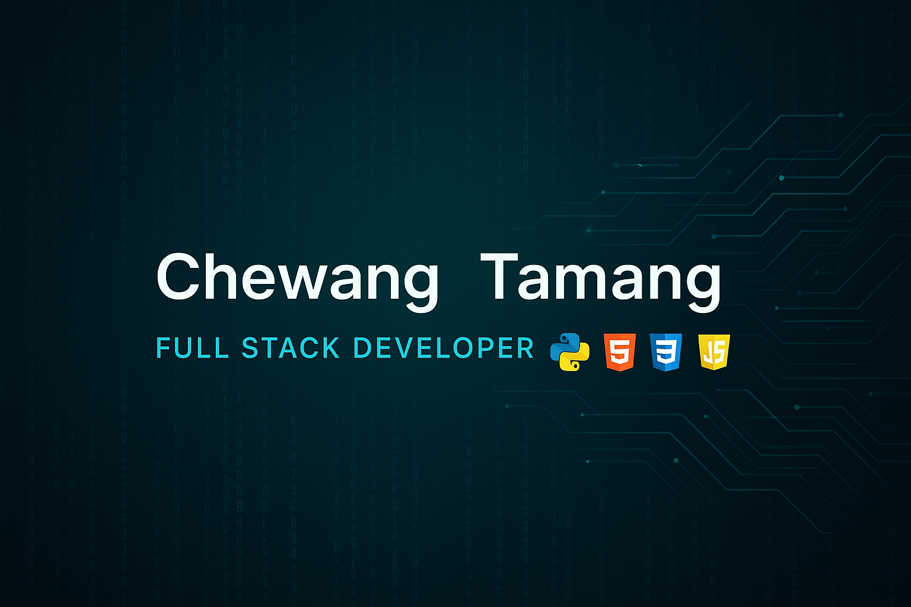

  

<!-- Profile Header -->
<h1 align="center">Hey 👋, I'm Chewang Tamang</h1>
<h3 align="center">🚀 Aspiring Full Stack Developer | 💻 Python, Django & JavaScript Lover</h3>

<!-- Add your GIF here -->

  <!-- Example:  -->
  

---

### 🧠 About Me
- 🔭 I’m currently working on personal web projects and sharpening my backend skills
- 🌱 Learning Django, MongoDB, and advanced frontend techniques
- 💬 Ask me about **HTML**, **JavaScript**, **CSS** or anything tech-related!
- 🎯 2025 Goal: Become a job-ready full stack developer

---

### 🛠️ Languages & Tools

  
  
  
  
  
  
  
  

---

### 📊 GitHub Stats

  
  

---

### 🌍 Connect with Me

  
  
   

